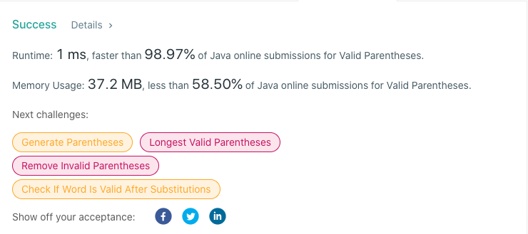

# 20. Valid Parentheses
## Code
```java
class Solution {
    public boolean isValid(String s) {
        Stack<Character> stack = new Stack<Character>();
        for (char c : s.toCharArray()) {
            if (c == '(')
                stack.push(')');
            else if (c == '{')
                stack.push('}');
            else if (c == '[')
                stack.push(']');
            else if (stack.isEmpty() || stack.pop() != c)
                return false;
        }
        return stack.isEmpty();
    }
}
```
## Result


## Complexity
### Time complexity
O(n) , where S is the sum of all characters in all strings.
### Space complexity
O(1). We only used constant extra space.