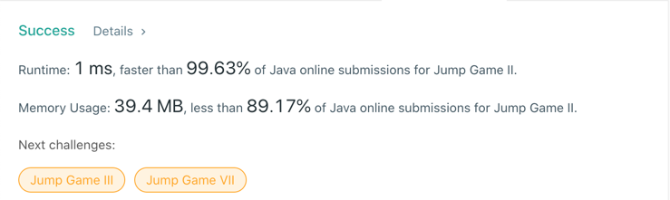

# 45. Jump Game II
## Code
```java
class Solution {
    public int jump(int[] nums) {
        if (nums.length <= 1) return 0;
        int max = 0;
        int level = 0, i = 0;
        while (i <= max) {
            int furthest = max;
            for (; i <= max; i++) {
                furthest = Math.max(furthest, nums[i] + i);
                if (furthest >= nums.length - 1) {
                    return level + 1;
                }
            }
            level++;
            max = furthest;
        }
        return -1;
    }
}
```
## Result


## Complexity
### Time complexity
O(N)