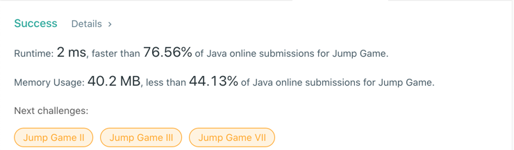

# 55. Jump Game
## Code
```java
class Solution {
    public boolean canJump(int[] nums) {
        int max = 0;
        for (int i = 0; i < nums.length; i++) {
            if (i > max) return false;
            max = Math.max(i + nums[i], max);
        }
        return true;
    }
}
```
## Result


## Complexity
### Time complexity
O(N)
### Space complexity
O(1)