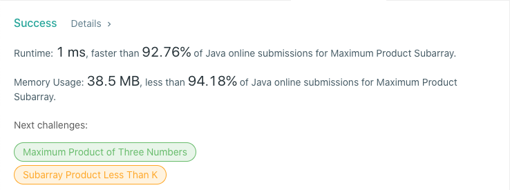

# 152. Maximum Product Subarray
## Code
```java
class Solution {
    public int maxProduct(int[] nums) {
        int max = nums[0];
        int min = nums[0];
        int res = nums[0];
        for (int i = 1; i < nums.length; i++) {

            if (nums[i] < 0) {
                int temp = max;
                max = min;
                min = temp;
            }

            max = Math.max(max * nums[i], nums[i]);
            min = Math.min(min * nums[i], nums[i]);

            res = Math.max(res, max);
        }
        return res;
    }
}
```
## Result


## Complexity
### Time complexity
O(N)
### Space complexity
O(1)