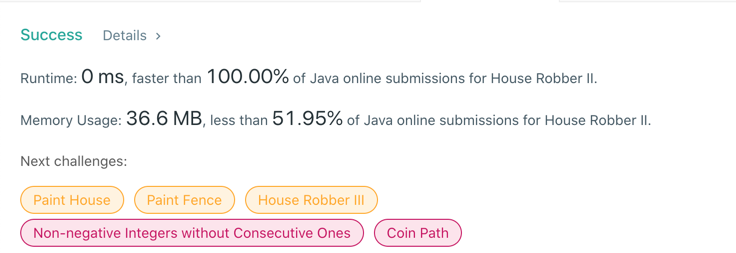

# 213. House Robber II
## Code
```java
class Solution {
    public int rob(int[] nums) {
        if (nums.length == 1) {
            return nums[0];
        }
        return Math.max(rob(nums, 0, nums.length - 2), rob(nums, 1, nums.length - 1));
    }

    public int rob(int[] nums, int start, int end) {
        if (start > end) return 0;
        int a = 0, b = 0;
        for (int i = start; i <= end; i++) {
            int res = Math.max(b, a + nums[i]);
            a = b;
            b = res;
        }
        return b;
    }
}
```
## Result


## Complexity
### Time complexity
O(N)
### Space complexity
O(1)