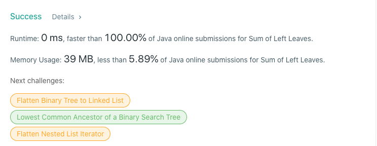

# 404. Sum of Left Leaves
## Code
```java
class Solution {
    public int sumOfLeftLeaves(TreeNode root) {
        if (root == null) return 0;
        if (root.left != null && root.left.left == null && root.left.right == null) {
            return root.left.val + sumOfLeftLeaves(root.right);
        }
        return sumOfLeftLeaves(root.left) + sumOfLeftLeaves(root.right);
    }
}
```
## Result


## Complexity
### Time complexity
O(n)
### Space complexity
O(k),  where k: height of a tree