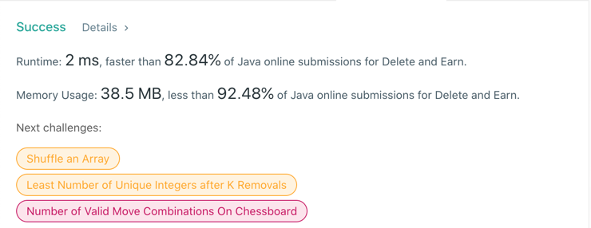

# 740. Delete and Earn
## Code
```java
class Solution {
    public int deleteAndEarn(int[] nums) {
        int[] bucket = new int[10001];
        for (int num : nums) {
            bucket[num] += num;
        }
        int take = 0, skip = 0;
        for (int value : bucket) {
            int takeRes = skip + value;
            int skipRes = Math.max(take, skip);
            take = takeRes;
            skip = skipRes;
        }

        return Math.max(take, skip);
    }
}
```
## Result


## Complexity
### Time complexity
O(N)
### Space complexity
O(1)