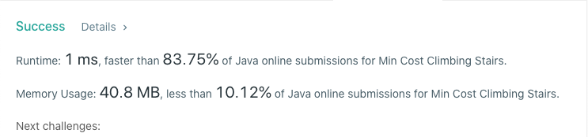

# 746. Min Cost Climbing Stairs
## Code
```java
class Solution {
    public int minCostClimbingStairs(int[] cost) {
        int n = cost.length;
        int a = cost[0];
        int b = cost[1];
        if (n <= 2) {
            return Math.min(a, b);
        }
        for (int i = 2; i < n; i++) {
            int sum = cost[i] + Math.min(a, b);
            a = b;
            b = sum;
        }
        return Math.min(a, b);
    }
}
```
## Result

## Complexity
### Time complexity
O(n)
### Space complexity
O(1)