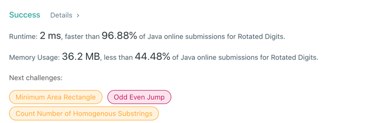

# 788. Rotated Digits
## Code
```java
class Solution {
    public static int rotatedDigits(int n) {
        for (int i = 0; i <= n; i++) {
            if (i < 10) {
                if (i == 0 || i == 1 || i == 8) {
                    nArray[i] = 1;
                } else if (i == 2 || i == 5 || i == 6 || i == 9) {
                    nArray[i] = 2;
                    res++;
                } else {
                    nArray[i] = 0;
                }
            } else {
                if (nArray[i / 10] == 1 && nArray[i % 10] == 1) {
                    nArray[i] = 1;
                } else if (nArray[i / 10] >= 1 && nArray[i % 10] >= 1) {
                    nArray[i] = 2;
                    res++;
                } else {
                    nArray[i] = 0;
                }
            }
        }
        return res;
    }
}
```
## Results

## Complexity
### Time complexity
for n -> O(n)
-> O(n)
### Space complexity