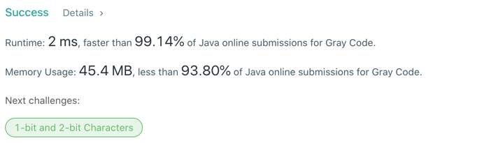

# 89. Add Two Numbers
## Code
```java
public class Solution {
    public static List<Integer> grayCode(int n) {
        Integer[] arr = new Integer[1 << n];
        for (int i = 0; i < arr.length; i++) {
            arr[i] = i ^ (i >> 1);
        }
        return Arrays.asList(arr);
    }
}
```
## Results

## Complexity
### Time complexity
for (; i < arr.length) {...} : O(n)
=> O(n)
### Space complexity