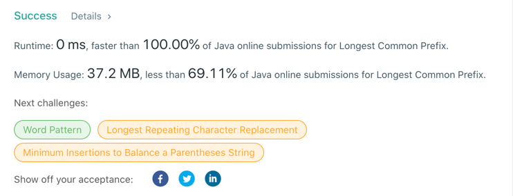

# 14. Longest Common Prefix
## Code
```java
class Solution {
    public String longestCommonPrefix(String[] strs) {
        if (strs == null || strs.length == 0) {
            return "";
        }
        for (int i = 0; i < strs[0].length(); i++) {
            char criteria = strs[0].charAt(i);
            for (int j = 1; j < strs.length; j++) {
                if (i == strs[j].length() || criteria != strs[j].charAt(i)) {
                    return strs[0].substring(0, i);
                }
            }
        }
        return strs[0];
    }
}
```
## Result


## Complexity
### Time complexity
O(S) , where S is the sum of all characters in all strings.
### Space complexity
O(1). We only used constant extra space.