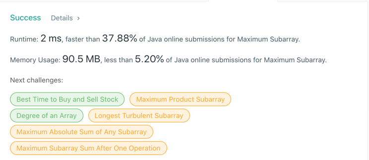

# 53. Maximum Subarray
## Code
```java
class Solution { // DP
    public int maxSubArray(int[] nums) {
        int sum = nums[0];
        int res = nums[0];
        for (int i = 1; i < nums.length; i++) {
            sum = Math.max(sum + nums[i], nums[i]);
            res = Math.max(sum, res);
        }

        return res;
    }
}
```
## Result
- DP

## Complexity
### Time complexity
- DP : O(n)