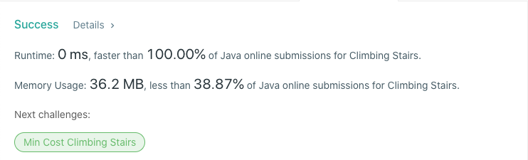

# 70. Climbing Stairs
## Code
기본 피보나치 수열에서 f(0)인 케이스만 없는 경우이다.  
재귀로 풀어내면 n = 36일 때 시간 제한에 걸린다.
```java
class Solution {
    public int climbStairs(int n) {
        if (n < 2) {
            return 1;
        }
        int a = 1, b = 2;
        while (--n > 1) {
            int sum = a + b;
            a = b;
            b = sum;
        }
        return b;
    }
}
```
## Result

## Complexity
### Time complexity
O(n)
### Space complexity
O(1)