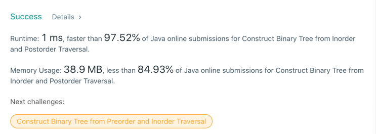

# 106. Construct Binary Tree from Inorder and Postorder Traversal
## Code
```java
class Solution {
    public TreeNode buildTree(int[] inorder, int[] postorder) {

        if (inorder == null && postorder == null) {
            return null;
        }

        Map<Integer, Integer> inorderMap = new HashMap<>();
        for (int i = 0; i < inorder.length; i++) {
            inorderMap.put(inorder[i], i);
        }

        return traverse(
                inorder, 0, inorder.length - 1,
                postorder, 0, postorder.length - 1,
                inorderMap);
    }

    public TreeNode traverse(
            int[] inorder, int inStartPos, int inEndPos,
            int[] postorder, int postStartPos, int postEndPos,
            Map<Integer, Integer> inorderMap) {

        if (inStartPos > inEndPos || postStartPos > postEndPos) {
            return null;
        }

        TreeNode tree = new TreeNode(postorder[postEndPos]);

        int rootPos = inorderMap.get(postorder[postEndPos]);

        TreeNode leftNode = traverse(
                inorder, inStartPos, rootPos - 1,
                postorder, postStartPos, postStartPos + rootPos - inStartPos - 1,
                inorderMap);

        TreeNode rightNode = traverse(
                inorder, rootPos + 1, inEndPos,
                postorder, postStartPos + rootPos - inStartPos, postEndPos - 1,
                inorderMap
        );

        tree.left = leftNode;
        tree.right = rightNode;
        return tree;
    }
}
```
## Result


## Complexity
### Time complexity
O(n)
### Space complexity
O(n)