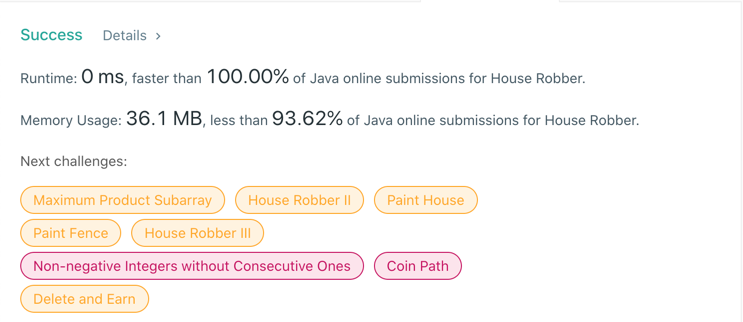

# 198. House Robber
## Code
```java
class Solution {
    public int rob(int[] nums) {
        if (nums.length == 0) {
            return 0;
        }
        int a = 0, b = 0;
        for (int curr : nums) {
            int res = Math.max(b, a + curr);
            a = b;
            b = res;
        }
        return b;
    }
}
```
## Result


## Complexity
### Time complexity
O(N)
### Space complexity
O(1)