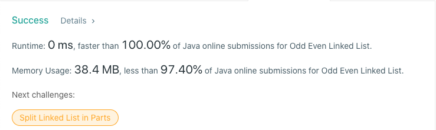

# 328. Odd Even Linked List
## Code
```java
class Solution {
    public ListNode oddEvenList(ListNode head) {
        if (head == null) return null;
        ListNode odd = head, even = head.next, evenHead = even;
        while (even != null && even.next != null) {
            odd.next = even.next;
            odd = odd.next;
            even.next = odd.next;
            even = even.next;
        }
        odd.next = evenHead;
        return head;
    }
}
```
## Result


## Complexity
### Time complexity
O(N)
### Space complexity
O(1)