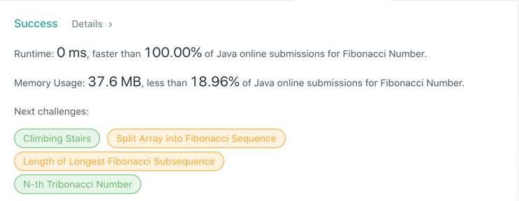

# 509. Fibonacci Number
## Code
- Recursive
```java
public class Solution {
    public int fib(int n) {
        if (n <= 1) {
            return n;
        } else {
            return fib(n - 1) + fib(n - 2);
        }
    }
}
```
- DP 1
```java
public class Solution {
    int[] dp = new int[31];
    public int fib(int n) {
        if (n <= 1) {
            return n;
        } else if (dp[n] != 0) {
            return dp[n];
        } else {
            return dp[n] = fib(n - 1) + fib(n - 2);
        }
    }
}
```  
- DP 2
```java
public class Solution {
    public int fib(int n) {
        if (n <= 1) {
            return n;
        }
        int[] dp = new int[n + 1];
        dp[1] = 1;
        for (int i = 2; i <= n; i++) {
            dp[i] = dp[i - 1] + dp[i - 2];
        }
        return dp[n];
    }
}
```  
- DP 3
```java
public class Solution {
    public int fib(int n) {
        if (n <= 1) {
            return n;
        }
        int a = 0, b = 1;
        while (n-- > 1) {
            int sum = a + b;
            a = b;
            b = sum;
        }
        return b;
    }
}
```
## Result
- DP 3


## Complexity
### Time complexity
- Recursive : O(N) -> O(logN) 
- DP 1 : O(N)
- DP 2 : O(N)
- DP 3 : O(N)
### Space complexity
- Recursive : O(N)
- DP 1 : O(N)
- DP 2 : O(N)
- DP 3 : O(1)