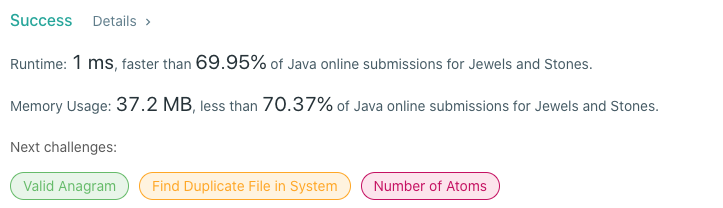

# 771. Jewels and Stones
## Code
```java
public class Solution {
    public static int numJewelsInStones(String jewels, String stones) {
        int output = 0;
        Set<Character> jewelType = new HashSet<>();
        for (char jewel : jewels.toCharArray()) {
            jewelType.add(jewel);
        }
        for (char stone : stones.toCharArray()) {
            output += jewelType.contains(stone) ? 1: 0;
        }
        return output;
    }
}
```
## Results

## Complexity
### Time complexity
for + for : O(n)
=> O(n)
### Space complexity