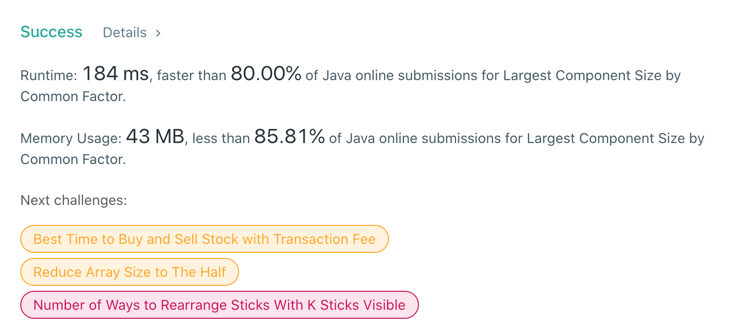

# 952. Largest Component Size by Common Factor
## Code
```java
class Solution {
    int[] temp;

    public int largestComponentSize(int[] nums) {
        int max = 0;
        for (int i : nums) {
            max = Math.max(i, max);
        }
        temp = new int[max + 1];
        for (int i = 1; i < max + 1; i++) {
            temp[i] = i;
        }

        for (int i : nums) {
            for (int j = (int) Math.sqrt(i); j >= 2; j--) {
                if (i % j == 0) {
                    union(i, j);
                    union(i, i / j);
                }
            }
        }

        int res = 0;
        Map<Integer, Integer> hashMap = new HashMap<>();
        for (int i : nums) {
            int j = find(i);
            if (!hashMap.containsKey(j)) {
                hashMap.put(j, 1);
            } else {
                hashMap.put(j, hashMap.get(j) + 1);
            }
            res = Math.max(res, hashMap.get(j));
        }

        return res;
    }

    int find(int x) {
        if (temp[x] == x) {
            return x;
        } else {
            return temp[x] = find(temp[x]);
        }
    }

    void union(int x, int y) {
        int getX = find(x);
        int getY = find(y);
        temp[getX] = temp[getY];
    }
}
```
## Result


## Complexity
### Time complexity
O(N * sqrt(W))