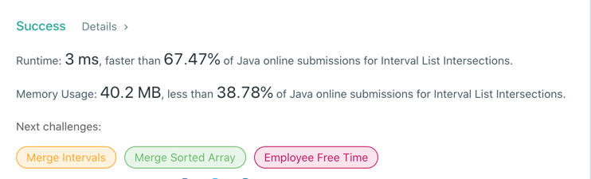
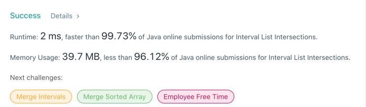

# 986. Interval List Intersections
## Code
```java
public class Solution {
    public int[][] intervalIntersection(int[][] firstList, int[][] secondList) {
        if (firstList == null || firstList.length == 0 || secondList == null || secondList.length == 0) {
            return new int[][]{};
        }

        List<int[]> res = new ArrayList<>();

        int idx1 = 0, idx2 = 0;
        int startMax, endMin;
        while (idx1 < firstList.length && idx2 < secondList.length) {
            startMax = Math.max(firstList[idx1][0], secondList[idx2][0]);
            endMin = Math.min(firstList[idx1][1], secondList[idx2][1]);
            if (endMin >= startMax)
                res.add(new int[]{startMax, endMin});
            if (firstList[idx1][1] == endMin)
                idx1++;
            if (secondList[idx2][1] == endMin)
                idx2++;
        }

        return res.toArray(new int[0][]);
    }
}
```
## Result
-  return res.toArray(new int[res.size()][2]);

- return res.toArray(new int[0][]);

## Complexity
### Time complexity
O(N + M), where N = firstList.length, M = secondList.length