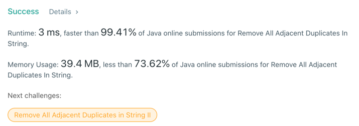

# 1047. Remove All Adjacent Duplicates In String
## Code
```java
public class Solution {
    public static String removeDuplicates(String s) {

        if (s.length() == 1) return s;
        int ptr = 0;
        char[] chars = s.toCharArray();
        for (int idx = 0; idx < chars.length; ++ptr, ++idx) {
            chars[ptr] = chars[idx];
            if (ptr > 0 && chars[ptr - 1] == chars[ptr]) {
                ptr -= 2;
            }
        }
        return new String(chars, 0, ptr);
    }
}
```
## Results

## Complexity
### Time complexity
for chars.length => 0(n)
=> O(n)
### Space complexity